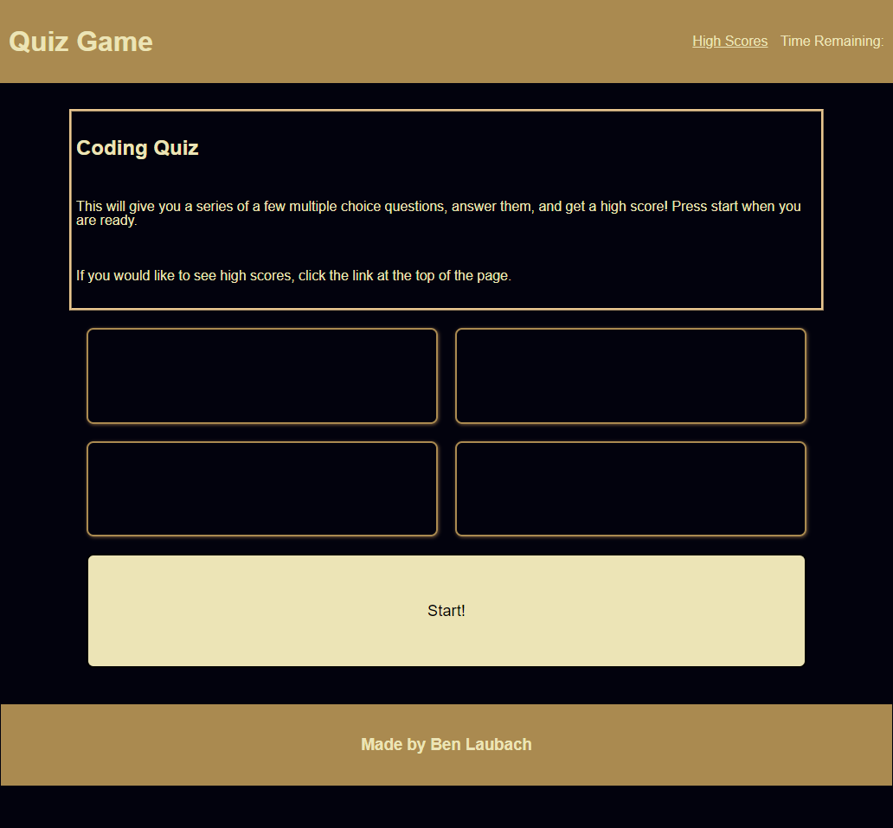

# Online Coding Quiz

## Description

The motivation for this project was to expand my skills with javascript specifically. I built a short quiz game, with a few coding questions. I learned a lot about how to break large problems into smaller steps, so that they are more managable and create a better workflow with my javascript.

## Installation

No installation required. Just visit the link [here](https://blaubachs.github.io/online-quizz/).

## Usage

Click the start button on the main page, and then click on the answers provided until you are moved to the high scores page. After, enter your initials and click submit. High scores are persistent in local storage, and the list should populate once the submit button is pressed.

## License

No license.

